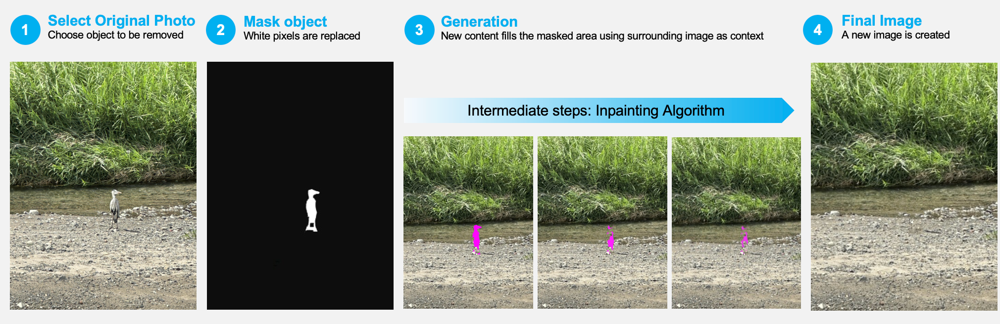

# Object Removal and Inpainting Overview

Inpainting is a technique that fills in plausible backgrounds after an object is removed from a photograph.  This repo attempted to replicate the results of the exemplar-based inpainting following the methods described in the Criminisi et al (2004)’s [paper](https://www.microsoft.com/en-us/research/wp-content/uploads/2016/02/criminisi_cvpr2003.pdf) 

## Object Removal & Inpainting 
I photographed this grey heron in the Kamo River, Kyoto, Japan in September 2024.  This graphic uses my own photo to show how my inpainting algorithm removes an object, from the original image and mask through intermediate steps to the final result. 

  

## Source Code

The final report and source code are maintained privately in accordance with university academic integrity requirements.

